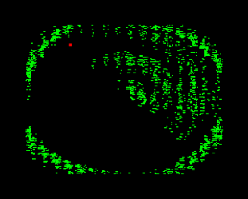

# SONAR

256 bytes intro

4th place @Lovebyte 2k23

## Tech
* ZX Spectrum 48 (128 or AY for noise)
* Z80 Assembler ( <=256 bytes executable size)
## Screenshot

## Build instruction
* Use Pasmo to build (compile.bat)

## Authors
* **Tomasz Słanina** - [dox/Joker](https://github.com/tslanina)
## License
This project is licensed under the MIT License - see the [LICENSE](LICENSE) file for details
